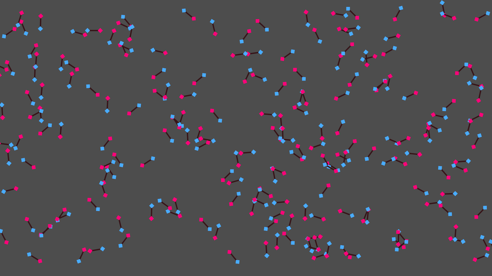
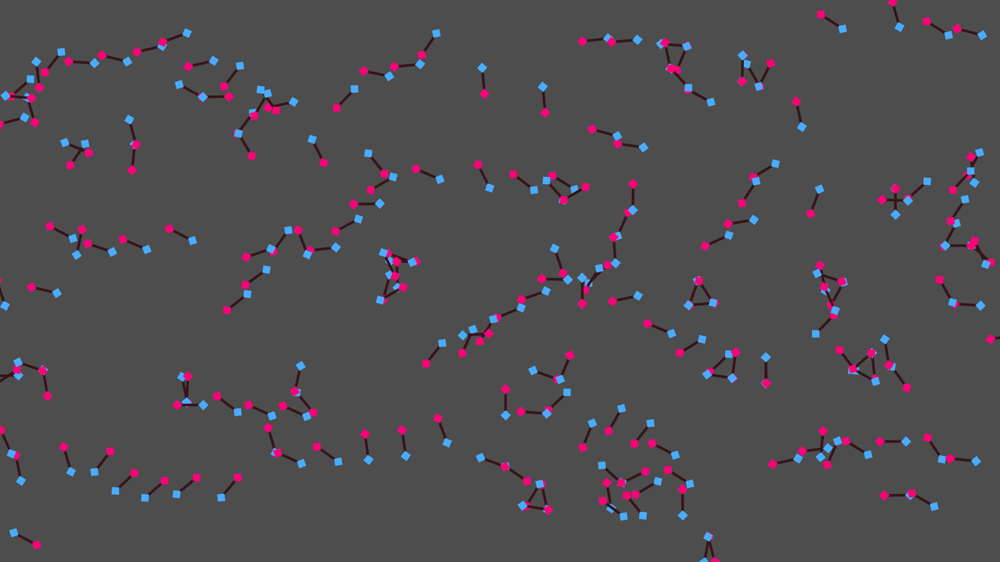

# Covalent Molecule Simulation

This Godot project creates small polar molecules which simulates them interacting through PD-PD forces on a 2D plane.

## Screenshots

|  |  |
|:-:|:-:|

## Running

Clone this repo and open it in [Godot](https://godotengine.org/).
